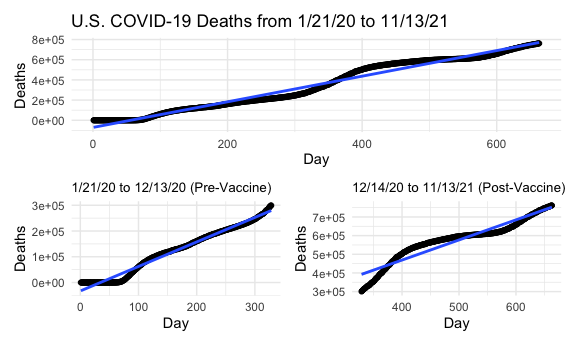

COVID-19 Trends Pre- and Post-Vaccine Availability
================

The date 12/14/20 was used as the date when vaccines became available in
the U.S. Date was converted to “day of pandemic” in order to do
regression on a numeric variable instead of YYYY-MM-DD.

## Data

``` r
us_covid = read_csv("./data/us.csv") %>% 
  mutate(day = 1:663,
         dc_ratio = deaths/cases)
```

## Death/Case Ratio


## Cases


## Deaths



## Slopes

| metric    | total\_case | pre\_vacc\_case | post\_vacc\_case | total\_death | pre\_vacc\_death | post\_vacc\_death |
|:----------|------------:|----------------:|-----------------:|-------------:|-----------------:|------------------:|
| intercept | -7696235.09 |     -2661121.00 |      -2747373.53 |   -70962.322 |      -32873.6457 |           38076.8 |
| slope     |    80278.44 |        42073.19 |         72767.71 |     1269.376 |         952.0364 |            1077.4 |
