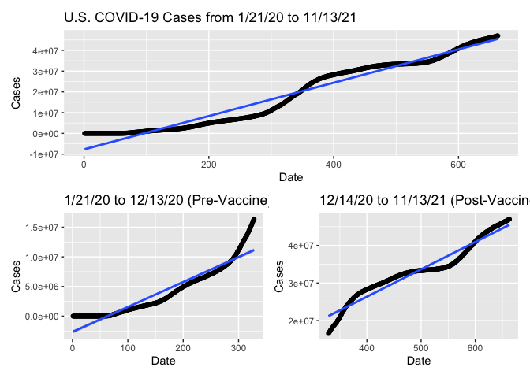
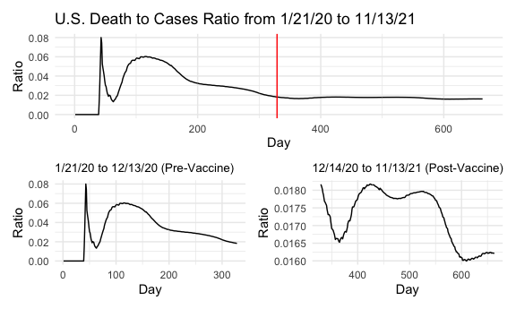

COVID-19 Trends Pre- and Post-Vaccine Wide Availability
================

``` r
library(tidyverse)
```

The date 4/19/21 was used as the date when vaccines became available for
all adults in the U.S. Plots were made with regressions forced to
intersect origin point (0, 0) and not forced to. Slopes are included for
both at the end of the plots. Date was converted to “day of pandemic” in
order to regress on a numeric variable instead of YYYY-MM-DD.

## Cases

``` r
us_covid = read_csv("./data/us.csv") %>% 
  mutate(day = 1:663)
```

    ## Rows: 663 Columns: 3

    ## ── Column specification ────────────────────────────────────────────────────────
    ## Delimiter: ","
    ## dbl  (2): cases, deaths
    ## date (1): date

    ## 
    ## ℹ Use `spec()` to retrieve the full column specification for this data.
    ## ℹ Specify the column types or set `show_col_types = FALSE` to quiet this message.

``` r
total_us_case_lm = lm(cases ~ 0 + day, data = us_covid)
us_covid %>% 
  ggplot(aes(x = day, y = cases)) +
  geom_point() +
  geom_smooth(method = "lm", formula = y ~ 0 + x) +
  labs(title = "U.S. COVID-19 Cases from 1/21/20 to 11/13/21",
       x = "Date", y = "Cases")
```

<!-- -->

``` r
pre_vacc_case_lm = 
  us_covid %>% 
  slice(1:454) %>% 
  lm(cases ~ 0 + day, data = .)
us_covid %>% 
  slice(1:454) %>% 
  ggplot(aes(x = day, y = cases)) +
  geom_point() +
  geom_smooth(method = "lm", formula = y ~ 0 + x) +
  labs(title = "U.S. COVID-19 Cases from 1/21/20 to 4/18/21 (Pre-Vaccine)",
       x = "Date", y = "Cases")
```

<!-- -->

``` r
post_vacc_case_lm = 
  us_covid %>% 
  slice(455:663) %>% 
  mutate(new_cases = cases - 31754642,
         new_deaths = deaths - 567314,
         new_day = day - 454) %>%
  lm(new_cases ~ 0 + day, data = .)
us_covid %>% 
  slice(455:663) %>% 
  mutate(new_cases = cases - 31754642,
         new_deaths = deaths - 567314,
         new_day = day - 454) %>%
  ggplot(aes(x = new_day, y = new_cases)) +
  geom_point() +
  geom_smooth(method = "lm", formula = y ~ 0 + x) +
  labs(title = "U.S. COVID-19 Cases from 4/19/21 to 11/13/21 (Post-Vaccine)",
       x = "Date", y = "Cases")
```

<!-- -->

## Deaths

``` r
total_us_death_lm = lm(deaths ~ 0 + day, data = us_covid)
us_covid %>% 
  ggplot(aes(x = day, y = deaths)) +
  geom_point() +
  geom_smooth(method = "lm", formula = y ~ 0 + x) +
  labs(title = "U.S. COVID-19 Deaths from 1/21/20 to 11/13/21",
       x = "Date", y = "Deaths")
```

<!-- -->

``` r
pre_vacc_death_lm = 
  us_covid %>% 
  slice(1:454) %>% 
  lm(deaths ~ 0 + day, data = .)
us_covid %>% 
  slice(1:454) %>% 
  ggplot(aes(x = day, y = deaths)) +
  geom_point() +
  geom_smooth(method = "lm", formula = y ~ 0 + x) +
  labs(title = "U.S. COVID-19 Deaths from 1/21/20 to 4/18/21 (Pre-Vaccine)",
       x = "Date", y = "Deaths")
```

<!-- -->

``` r
post_vacc_death_lm = 
  us_covid %>% 
  slice(455:663) %>% 
  mutate(new_cases = cases - 31754642,
         new_deaths = deaths - 567314,
         new_day = day - 454) %>%
  lm(new_deaths ~ 0 + day, data = .)
us_covid %>% 
  slice(455:663) %>% 
  mutate(new_cases = cases - 31754642,
         new_deaths = deaths - 567314,
         new_day = day - 454) %>%
  ggplot(aes(x = new_day, y = new_deaths)) +
  geom_point() +
  geom_smooth(method = "lm", formula = y ~ 0 + x) +
  labs(title = "U.S. COVID-19 Deaths from 4/19/21 to 11/13/21 (Post-Vaccine)",
       x = "Date", y = "Deaths")
```

<!-- -->

## Slopes

``` r
tibble(
  metric = "slope",
  total_case = total_us_case_lm$coefficients,
  pre_vacc_case = pre_vacc_case_lm$coefficients,
  post_vacc_case = post_vacc_case_lm$coefficients,
  total_death = total_us_death_lm$coefficients,
  pre_vacc_death = pre_vacc_death_lm$coefficients,
  post_vacc_death = post_vacc_death_lm$coefficients
  ) %>% 
  knitr::kable()
```

| metric | total\_case | pre\_vacc\_case | post\_vacc\_case | total\_death | pre\_vacc\_death | post\_vacc\_death |
|:-------|------------:|----------------:|-----------------:|-------------:|-----------------:|------------------:|
| slope  |    62879.27 |        53316.94 |         11256.64 |     1108.949 |         1043.324 |          136.8469 |

## Cases

``` r
us_covid = read_csv("./data/us.csv") %>% 
  mutate(day = 1:663)
```

    ## Rows: 663 Columns: 3

    ## ── Column specification ────────────────────────────────────────────────────────
    ## Delimiter: ","
    ## dbl  (2): cases, deaths
    ## date (1): date

    ## 
    ## ℹ Use `spec()` to retrieve the full column specification for this data.
    ## ℹ Specify the column types or set `show_col_types = FALSE` to quiet this message.

``` r
total_us_case_lm = lm(cases ~ day, data = us_covid)
us_covid %>% 
  ggplot(aes(x = day, y = cases)) +
  geom_point() +
  geom_smooth(method = "lm", formula = y ~ x) +
  labs(title = "U.S. COVID-19 Cases from 1/21/20 to 11/13/21",
       x = "Date", y = "Cases")
```

<!-- -->

``` r
pre_vacc_case_lm = 
  us_covid %>% 
  slice(1:454) %>% 
  lm(cases ~ day, data = .)
us_covid %>% 
  slice(1:454) %>% 
  ggplot(aes(x = day, y = cases)) +
  geom_point() +
  geom_smooth(method = "lm", formula = y ~ x) +
  labs(title = "U.S. COVID-19 Cases from 1/21/20 to 4/18/21 (Pre-Vaccine)",
       x = "Date", y = "Cases")
```

<!-- -->

``` r
post_vacc_case_lm = 
  us_covid %>% 
  slice(455:663) %>% 
  mutate(new_cases = cases - 31754642,
         new_deaths = deaths - 567314,
         new_day = day - 454) %>%
  lm(new_cases ~ day, data = .)
us_covid %>% 
  slice(455:663) %>% 
  mutate(new_cases = cases - 31754642,
         new_deaths = deaths - 567314,
         new_day = day - 454) %>%
  ggplot(aes(x = new_day, y = new_cases)) +
  geom_point() +
  geom_smooth(method = "lm", formula = y ~ x) +
  labs(title = "U.S. COVID-19 Cases from 4/19/21 to 11/13/21 (Post-Vaccine)",
       x = "Date", y = "Cases")
```

<!-- -->

## Deaths

``` r
total_us_death_lm = lm(deaths ~ day, data = us_covid)
us_covid %>% 
  ggplot(aes(x = day, y = deaths)) +
  geom_point() +
  geom_smooth(method = "lm", formula = y ~ x) +
  labs(title = "U.S. COVID-19 Deaths from 1/21/20 to 11/13/21",
       x = "Date", y = "Deaths")
```

<!-- -->

``` r
pre_vacc_death_lm = 
  us_covid %>% 
  slice(1:454) %>% 
  lm(deaths ~ day, data = .)
us_covid %>% 
  slice(1:454) %>% 
  ggplot(aes(x = day, y = deaths)) +
  geom_point() +
  geom_smooth(method = "lm", formula = y ~ x) +
  labs(title = "U.S. COVID-19 Deaths from 1/21/20 to 4/18/21 (Pre-Vaccine)",
       x = "Date", y = "Deaths")
```

<!-- -->

``` r
post_vacc_death_lm = 
  us_covid %>% 
  slice(455:663) %>% 
  mutate(new_cases = cases - 31754642,
         new_deaths = deaths - 567314,
         new_day = day - 454) %>%
  lm(new_deaths ~ day, data = .)
us_covid %>% 
  slice(455:663) %>% 
  mutate(new_cases = cases - 31754642,
         new_deaths = deaths - 567314,
         new_day = day - 454) %>%
  ggplot(aes(x = new_day, y = new_deaths)) +
  geom_point() +
  geom_smooth(method = "lm", formula = y ~ x) +
  labs(title = "U.S. COVID-19 Deaths from 4/19/21 to 11/13/21 (Post-Vaccine)",
       x = "Date", y = "Deaths")
```

<!-- -->

## Slopes

``` r
tibble(
  metric = c("intercept", "slope"),
  total_case = total_us_case_lm$coefficients,
  pre_vacc_case = pre_vacc_case_lm$coefficients,
  post_vacc_case = post_vacc_case_lm$coefficients,
  total_death = total_us_death_lm$coefficients,
  pre_vacc_death = pre_vacc_death_lm$coefficients,
  post_vacc_death = post_vacc_death_lm$coefficients
  ) %>% 
  knitr::kable()
```

| metric    | total\_case | pre\_vacc\_case | post\_vacc\_case | total\_death | pre\_vacc\_death | post\_vacc\_death |
|:----------|------------:|----------------:|-----------------:|-------------:|-----------------:|------------------:|
| intercept | -7696235.09 |     -7061989.13 |     -38158015.72 |   -70962.322 |       -79015.493 |      -422026.3727 |
| slope     |    80278.44 |        76623.84 |         78731.85 |     1269.376 |         1304.101 |          883.1205 |
