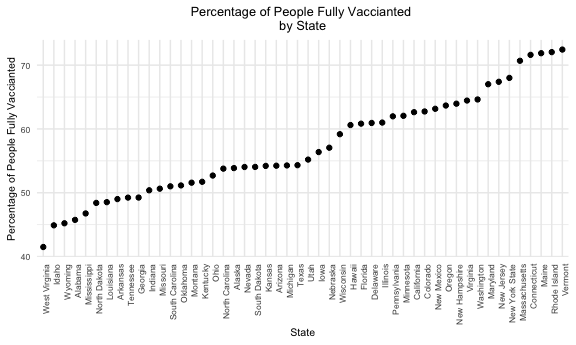
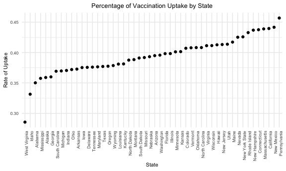
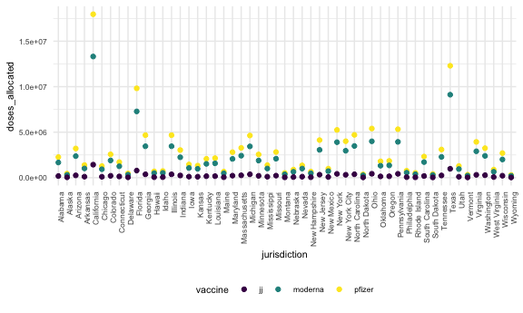

Visualizations
================
11/21/2021

## How has the vaccine been distributed in these areas? What are the rates of uptake/vaccination?

First look at percentage of people vaccinated by each state

``` r
perc_vacc = 
  read_csv(file = "./data/us_state_vaccinations.csv") %>%
  filter(date == "2021-11-20") %>%
  filter(!(location %in% c("Virgin Islands", "Veterans Health","Republic of Palau", "Puerto Rico",   "Northern Mariana Islands", "Marshall Islands", "Indian Health Svc", "Guam", "Federated States of Micronesia", "District of Columbia", "Dept of Defense", "Bureau of Prisons", "American Samoa",    "United States"))) %>% 
  select(location, people_fully_vaccinated_per_hundred)
```

    ## Rows: 19795 Columns: 14

    ## ── Column specification ────────────────────────────────────────────────────────
    ## Delimiter: ","
    ## chr   (1): location
    ## dbl  (12): total_vaccinations, total_distributed, people_vaccinated, people_...
    ## date  (1): date

    ## 
    ## ℹ Use `spec()` to retrieve the full column specification for this data.
    ## ℹ Specify the column types or set `show_col_types = FALSE` to quiet this message.

``` r
url = "https://developers.google.com/public-data/docs/canonical/states_csv"
latlong_html = read_html(url)

latlong_df = 
  latlong_html %>% 
  html_table() %>% 
  as.data.frame() %>% 
  select(-state) %>% 
  relocate(name) %>% 
  rename(location = name) %>% 
  mutate(
     location = recode(location, "New York" = "New York State"))
```

Merging of dataset to get lat/long

``` r
map_df = merge(perc_vacc, latlong_df , by = "location")
```

Plot of percentage vaccinated

``` r
map_df %>%
  mutate(
    location = fct_reorder(location, people_fully_vaccinated_per_hundred)
  ) %>% 
  ggplot(aes(x = location, y = people_fully_vaccinated_per_hundred)) +
  geom_point() +
  labs(
    x = "State",
    y = "Percentage of People Fully Vaccianted",
    title = "Percentage of People Fully Vaccianted \nby State") +
  theme(plot.title = element_text(hjust = 0.5)) +
  theme(text = element_text(size = 8),
        axis.text.x = element_text(angle = 90, hjust = 1))
```



Map of percentage vaccinated

``` r
pal = colorNumeric("viridis", NULL)

#map_df %>% 
  #leaflet() %>% 
  #addTiles() %>% 
  #addCircleMarkers(~longitude, ~latitude, color = ~pal(people_fully_vaccinated_per_hundred))

#Work on creating choropleth map (?)
```

Now look at total number of vaccines shipped to each state and the
number of people vaccianted

``` r
uptake_df = 
 read_csv(file = "./data/us_state_vaccinations.csv") %>%
  filter(date == "2021-11-20") %>%
  filter(!(location %in% c("Virgin Islands", "Veterans Health","Republic of Palau", "Puerto Rico",   "Northern Mariana Islands", "Marshall Islands", "Indian Health Svc", "Guam", "Federated States of Micronesia", "District of Columbia", "Dept of Defense", "Bureau of Prisons", "American Samoa",    "United States"))) %>% 
  select(location, people_vaccinated, total_distributed) %>% 
  mutate(
    rate_of_uptake = people_vaccinated / total_distributed)
```

    ## Rows: 19795 Columns: 14

    ## ── Column specification ────────────────────────────────────────────────────────
    ## Delimiter: ","
    ## chr   (1): location
    ## dbl  (12): total_vaccinations, total_distributed, people_vaccinated, people_...
    ## date  (1): date

    ## 
    ## ℹ Use `spec()` to retrieve the full column specification for this data.
    ## ℹ Specify the column types or set `show_col_types = FALSE` to quiet this message.

Plot rate of uptake by state

``` r
uptake_df %>% 
  mutate(
    location = fct_reorder(location, rate_of_uptake)) %>% 
  ggplot(aes(x = location, y = rate_of_uptake)) +
  geom_point() +
  labs(
    x = "State",
    y = "Rate of Uptake",
    title = "Percentage of Vaccination Uptake by State") +
  theme(plot.title = element_text(hjust = 0.5)) +
  theme(text = element_text(size = 8),
        axis.text.x = element_text(angle = 90, hjust = 1)) 
```



Create choropleth map for this (?)

Let’s look at how the different vaccines are distributed in the US

Pfizer Allocation

``` r
pfizer_df = 
  GET("https://data.cdc.gov/resource/saz5-9hgg.csv") %>% 
  content() %>% 
  janitor::clean_names() %>% 
  filter(!(jurisdiction %in% c("Virgin Islands", "Veterans Health","Republic of Palau", "Puerto Rico", "Northern Mariana Islands", "Marshall Islands", "Indian Health Svc", "Guam", "Federated States of Micronesia", "District of Columbia", "Dept of Defense", "Bureau of Prisons", "American Samoa", "United States", "Federal Entities", "Mariana Islands", "Micronesia", "Palau", "U.S. Virgin Islands"))) %>% 
  group_by(jurisdiction) %>% 
  summarize(sum_of_first = sum(x1st_dose_allocations)) %>% 
  mutate(
    sum_of_first = sum_of_first * 2) %>%
  rename(pfizer = sum_of_first)
```

    ## Rows: 1000 Columns: 4

    ## ── Column specification ────────────────────────────────────────────────────────
    ## Delimiter: ","
    ## chr  (1): jurisdiction
    ## dbl  (2): _1st_dose_allocations, _2nd_dose_allocations
    ## dttm (1): week_of_allocations

    ## 
    ## ℹ Use `spec()` to retrieve the full column specification for this data.
    ## ℹ Specify the column types or set `show_col_types = FALSE` to quiet this message.

Moderna Allocation

``` r
moderna_df = 
  GET("https://data.cdc.gov/resource/b7pe-5nws.csv") %>% 
  content() %>% 
  janitor::clean_names() %>% 
  filter(!(jurisdiction %in% c("Virgin Islands", "Veterans Health","Republic of Palau", "Puerto Rico", "Northern Mariana Islands", "Marshall Islands", "Indian Health Svc", "Guam", "Federated States of Micronesia", "District of Columbia", "Dept of Defense", "Bureau of Prisons", "American Samoa", "United States", "Federal Entities", "Mariana Islands", "Micronesia", "Palau", "U.S. Virgin Islands"))) %>% 
  group_by(jurisdiction) %>% 
  summarize(sum_of_first = sum(x1st_dose_allocations)) %>% 
  mutate(
    sum_of_first = sum_of_first * 2) %>%
  rename(moderna = sum_of_first)
```

    ## Rows: 1000 Columns: 4

    ## ── Column specification ────────────────────────────────────────────────────────
    ## Delimiter: ","
    ## chr  (1): jurisdiction
    ## dbl  (2): _1st_dose_allocations, _2nd_dose_allocations
    ## dttm (1): week_of_allocations

    ## 
    ## ℹ Use `spec()` to retrieve the full column specification for this data.
    ## ℹ Specify the column types or set `show_col_types = FALSE` to quiet this message.

J&J Allocation

``` r
jj_df = 
  GET("https://data.cdc.gov/resource/w9zu-fywh.csv") %>% 
  content() %>% 
  janitor::clean_names() %>% 
  filter(!(jurisdiction %in% c("Virgin Islands", "Veterans Health","Republic of Palau", "Puerto Rico", "Northern Mariana Islands", "Marshall Islands", "Indian Health Svc", "Guam", "Federated States of Micronesia", "District of Columbia", "Dept of Defense", "Bureau of Prisons", "American Samoa", "United States", "Federal Entities", "Mariana Islands", "Micronesia", "Palau", "U.S. Virgin Islands"))) %>% 
  group_by(jurisdiction) %>% 
  summarize(sum_of_first = sum(x1st_dose_allocations)) %>% 
  rename(jj = sum_of_first)
```

    ## Rows: 504 Columns: 3

    ## ── Column specification ────────────────────────────────────────────────────────
    ## Delimiter: ","
    ## chr  (1): jurisdiction
    ## dbl  (1): _1st_dose_allocations
    ## dttm (1): week_of_allocations

    ## 
    ## ℹ Use `spec()` to retrieve the full column specification for this data.
    ## ℹ Specify the column types or set `show_col_types = FALSE` to quiet this message.

Merge all three vaccines

``` r
pfizer_moderna_df = 
  merge(pfizer_df, moderna_df, by = "jurisdiction")

all_vacc_df = 
  merge(pfizer_moderna_df, jj_df, by = "jurisdiction") %>% 
  pivot_longer(
    pfizer:jj,
    names_to = "vaccine",
    values_to = "doses_allocated")
```

Plot

``` r
# Could possibly make this into a plotly...Having a hard time deciding how to best show this allocation

all_vacc_df %>% 
  ggplot(aes(x = jurisdiction, y = doses_allocated, color = vaccine)) +
  geom_point() +
   theme(text = element_text(size = 8),
        axis.text.x = element_text(angle = 90, hjust = 1)) 
```


